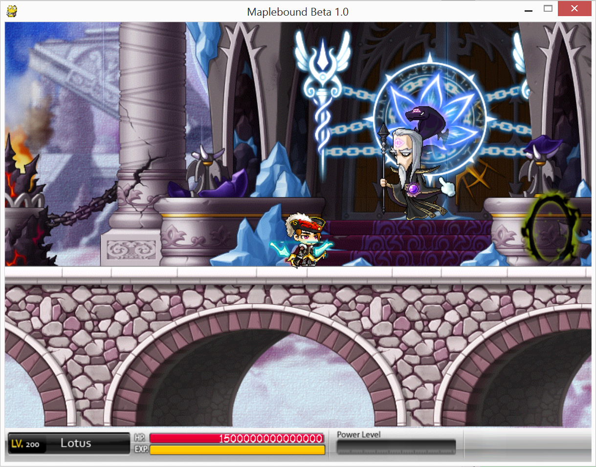
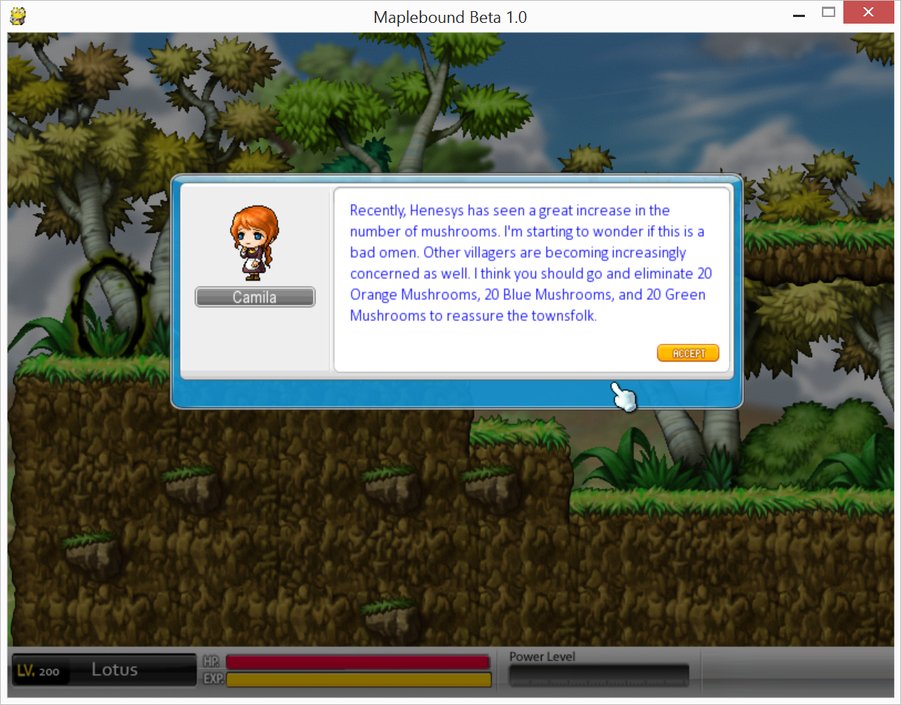
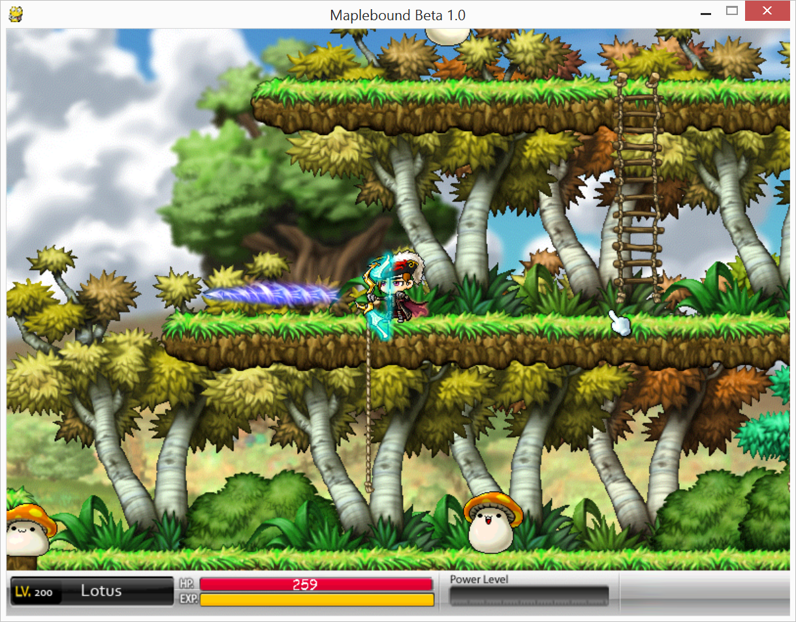
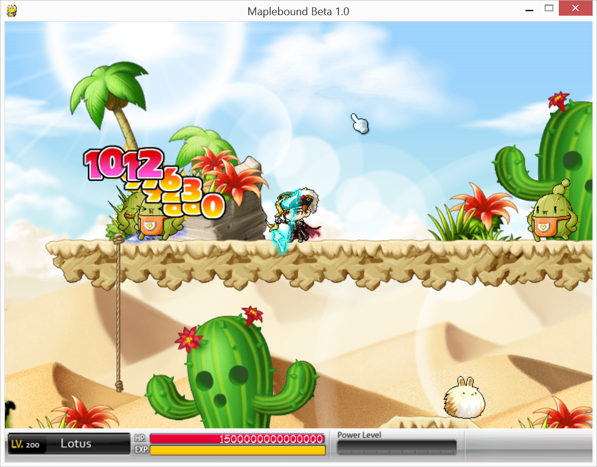
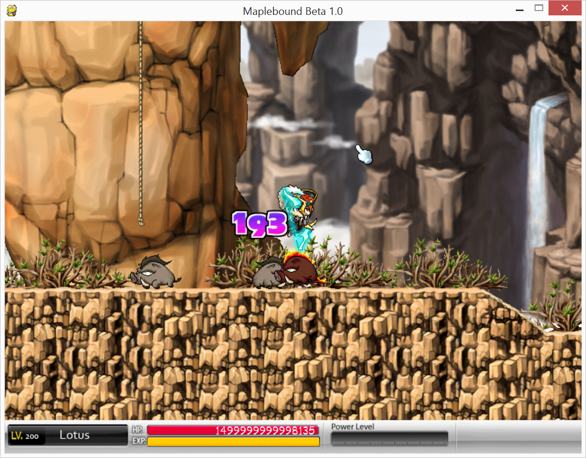
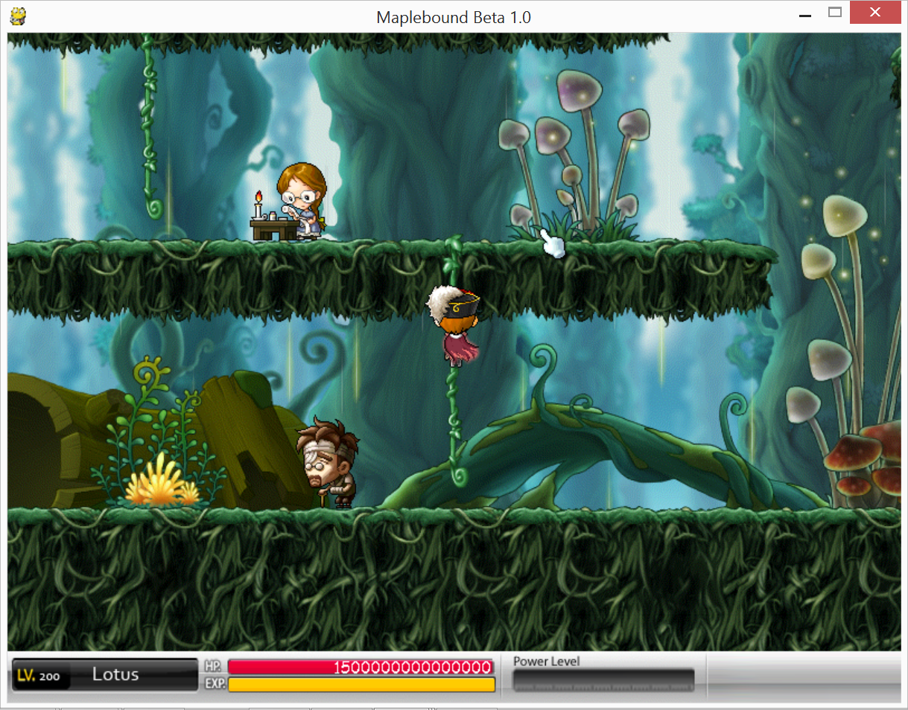

# 

## Remarks
- Uses sprites/sounds from **Nexon**'s *Maplestory* and clip-art from the interwebz (creds go to respective owners)
- Programmed by two people: **Game Engine** written by *Shiyang Han* (that's me!) and **Scripting** done by *Weiyi Dai*
- We tried to incorporate elements of *Gunbound* as well, but constraints didn't allow for much (naming still stayed though)
- An RPG-esque rogue-like side-scroller which (as usual) isn't balanced super duper well [unsurprisingly]

## Features
- "Rich" story in a colourful and immersive world (thanks *Maplestory*!)
- Delicious rogue-like side-scroller with shooting action
- Platformer physics, including ability to climb ladders and ropes
- Moveable dialogue boxes with fancy transitions, interactive buttons, and stretch to fit content
- **Custom Scripting System for NPCs, Maps, Mobs, Portals and Quests!**
- Reactors for triggering region portals when quests are satisfied
- Generated damage number images (including critical hits)
- UI Overlay with stat indicators
- Over 20 NPCS - complete with vibrant dialogue and QUESTS
- Over 25 Different Maps, covering 8 different regions
- Over 60 Portals to explore with
- Over 20 Mobs, each with sound effects, AI behaviour (ooh aggro), multiple animations and death effects
- QUESTS to advance progress~ (and power-ups for rewards)

## Controls
- `Left`, `Right` for movement
- `L-Alt` to jump
- `L-Shift` to charge bow
- `WS` to aim bow while charging
- `Up`, `Down` to climb ladders and ropes
- `Up` to enter portals
- `Down` to crouch
- Mouse to interact with NPCs

## Building and Running
Requires Python 2.7 with the appropriate Pygame installed. Also requires Py2Exe to compile.
1) Run `Maplebound Beta 1.0.py` using Python to run the game **OR**
2) Run `build.sh`, which builds an exe in the `dist` folder using `compile.py` **OR**
3) Alternatively, just download a built executable from [Here](https://www.mediafire.com/file/bz33r2ihb9camk3/MapleBound%20Beta%201.0.rar), extract and run `Maplebound Beta 1.0.exe` **AND**
4) Click anywhere to begin. "Have Fun :)"

### Regarding Custom Content (if you're curious about the engine)
- We use a custom scripting system which follows a set of conventions to allow for a great amount of flexibility when designing content without the need to recompile
- Should be fairly self-explanatory (just look at any map.txt in each map for example), but I'll highlight a few
- Maybe I'll take the time to explain all conventions in the future... (ie: `nop.jpg`)

#### Maps
- Sections are specified using `/#[TagName]` opening and closing tags, with individual data delimited by `$` and `,`
- `/#bg` specifies the image to use in the `bg` folder of the map section
- `/#npc` specifies npcs, with each NPC on a new line following the format, `name$posx,posy$`
- `/#portal` specifies portals, with each Portal on a new line following the format, `portalId$posx,posy$portalTypeId`
- `/#mob` specifies mobs, with each Mob on a new line following the format, `mobName$posx,posy`
- `/#spawnpoint` specifies mob spawn points, with each Mob on a new line following the format, `mobName$posx,posy$spawnTimer`
- `/#sound` specifies which bgm (in the `bgm` folder of the sound section) plays on the map
- Maps also have reactors to determine conditions for a portal to spawn

#### NPC Chat
- NPC Chat boxes always start with frame 0, appropriately stored in a text file called `0.txt`
- Each frame has the following format:
- First comes any number of lines, which all get strung together as actual dialogue (ignoring newlines) - to insert a new line, use `/br`, much like html
- When text is done, a `/#e` is given, which is used indicate the end of text, and beginning of dialogue button scripting
- Dialogues can have 3 buttons - one in the bottom left, 2 in the bottom right (in order of script)
- Each button is delimited by spaces and is specified in the form `[ButtonName]$[ButtonAction]-[ButtonActionArg0]-[ButtonActionArg1]-[ButtonActionArgN]`
- For example, `/#e end$r none$r none$r` spawns an `end` button in the first slot, which exits the dialogue box (r for return) when clicked and nothing in the other two slots

#### Portals
- Named as `portalId.txt`
- Each portal script contains just one line of the format `destinationMap-destPortalNum`, where `destPortalNum` is the index of the portal on the destination map (and not its id)

#### More In-Depth Explanation to (Unlikely) Come...
Thanks for stopping by!
